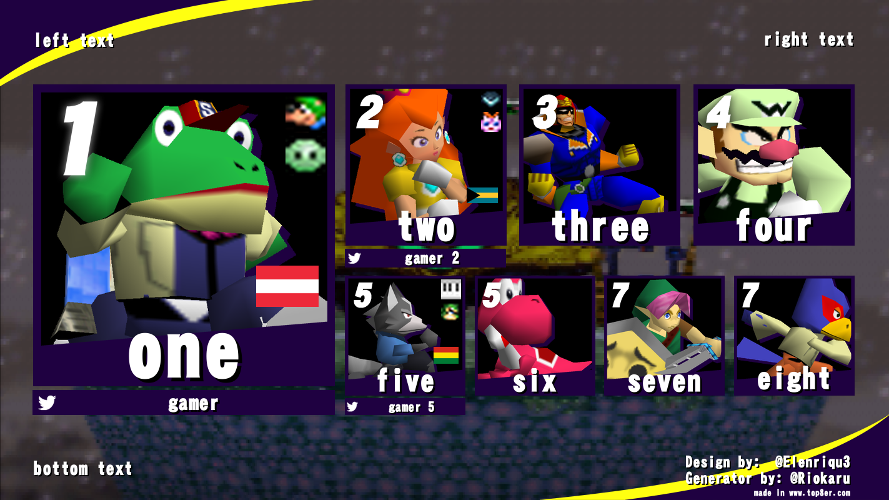
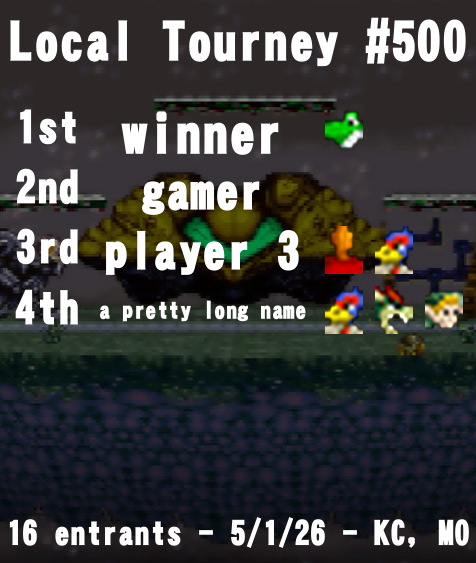

# Purpose
Collection of scripts to make it easier to update websites/programs with the latest Remix assets and metadata.

Credit goes to joaorb64 for their work on [StreamHelperAssets](https://joaorb64.github.io/StreamHelperAssets/) for Remix, which made this all much easier.

## [parry.gg](https://parry.gg/)
Competitor to start.gg that has a mobile app.  They use a [game metadata repo](https://github.com/parry-gg/game-metadata) for maintaining characters & stages for games.

This repo has utilities that will package characters and stages for vanilla and Remix for addition to their platform and CDN, reusing vanilla assets between the two games.  Assets include stock icons for each color, stage images, and JSON for character & stages.

When a new version of Remix adds characters/colors/stages, you can use these utils to make it easy to make a PR for the above repo.

## [Top8er](https://www.top8er.com/)
Website that lets you generate tourney result or PR images.  The website is [open source](https://github.com/ShonTitor/Top8er).  Asset/metadata contributions are managed via Discord and must be added manually by the owner.

This repo has utilities that will crop and package character portraits for each color, stock icons for each color, and JSON for Smash Remix.

When a new version of Remix adds characters/colors, you can use these utils to make it easy to bundle the assets.  Manually edit the JSON file with any changes needed.  Then [follow this process](https://github.com/ShonTitor/Top8er/blob/master/HowToHelp.md) to get them added to the site.  In the mean time, you can run a local Django server using the repo above and use that to generate images.

## [start.gg](https://www.start.gg/)
Tournament manager.  Some games have the ability to report match data that includes characters, stock count, and stage.  Currently, they are NOT adding stage reporting to more games however.

This repo has utilities that will package cropped square full portraits, stock icons (default color only; they do not support alt colors yet) in a couple different sizes to match what they have for vanilla, and a reference JSON that includes characters and stages.  The JSON is not currently in use by default since they aren't accepting stages now.

When a new version of Remix adds characters/stages, you can use these utils to bundle assets/metadata for them.  Then, you can send it to their support email and hope that someone adds them. 
